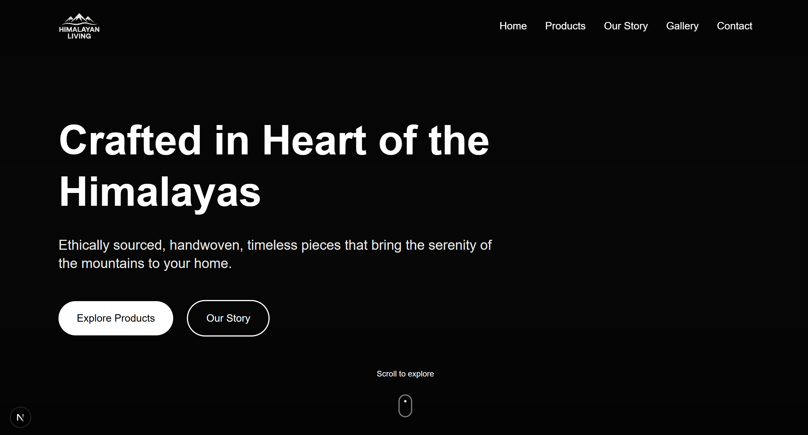

# 🏔️ Himalayan Living – A Premium Lifestyle Brand Website

**Himalayan Living** is a beautifully designed, modern, and responsive lifestyle brand website built with **Next.js** and **Tailwind CSS**. The brand celebrates the serene aesthetics of the Himalayas and the rich craftsmanship of Nepal through a luxurious, minimal, and user-friendly interface.

 

 

## 🧱 Tech Stack

- **Framework**: [Next.js](https://nextjs.org/)
- **Styling**: [Tailwind CSS](https://tailwindcss.com/)
- **Animations**: [Framer Motion](https://www.framer.com/motion/)
- **Icons**: [Heroicons](https://heroicons.com/), [Lucide-react](https://lucide.dev/)

 

## ✨ Features

- 🎨 **Rich UI/UX Design** with smooth transitions and elegant layout
- 🏞️ **Hero Section** with brand message and CTA
- 🛍️ **Product Showcase** (Home, Wear, Wellness categories)
- 📖 **Brand Story Page** with timeline and parallax design
- 📸 **Lookbook Gallery** with lightbox and image animation
- 💬 **Contact Form** with smooth UX and validation
- 📱 **Fully Responsive** and Mobile-first optimized
- 🌗 **Dark Mode Gradient Text Handling**
- ⚡ **Framer Motion Animations** on elements and page transitions
 
 

## 🎯 Design Philosophy 

The site reflects:
- **Minimalism meets tradition**
- **Warm earthy tones and mountain motifs**
- A feel of **slow living, calmness, and handcrafted luxury **

